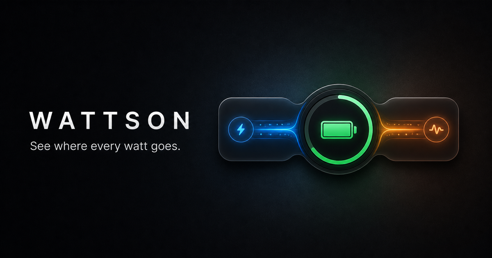

<h1 align="center">Wattson</h1>

<p align="center">
  <strong>See where every watt goes.</strong><br>
  A native macOS menu-bar app for live adapter, battery, and system power flow.
</p>

<p align="center">
  <a href="https://github.com/laleoarrow/battery-monitor/releases/latest"></a>
  <a href="https://github.com/laleoarrow/battery-monitor/actions/workflows/ci.yml"></a>
  
  
</p>

<p align="center">
  <a href="https://laleoarrow.github.io/battery-monitor/">Website</a>
  ·
  <a href="https://github.com/laleoarrow/battery-monitor/releases/latest">Download</a>
  ·
  <a href="https://github.com/laleoarrow/battery-monitor/releases/tag/v3.0.4">v3.0.4 release notes</a>
</p>

<p align="center">
  
</p>

## Power, made visible

Wattson turns the relationship between your adapter, battery, and Mac into one
calm live map. Open it from the menu bar to see where power is coming from,
where it is going, and how the picture has changed over the last two minutes.

- Four distinct charging, full, on-battery, and mixed-supply states.
- Live system load, adapter input, battery flow, temperature, and cycle count.
- Auto and Low Power controls, plus High Power on supported Macs.
- Native Liquid Glass on macOS 26 with an AppKit fallback for macOS 12–25.
- Keyboard, VoiceOver, Reduce Motion, and Reduce Transparency support.
- Launch-at-login and system battery-icon controls.
- No account, analytics, cloud service, or external data upload.

## Install v3.0.4

| Route | Best for | What to do |
| --- | --- | --- |
| **DMG** · Recommended | Guided installation | [Download the universal DMG](https://github.com/laleoarrow/battery-monitor/releases/download/v3.0.4/Wattson-v3.0.4-macos-universal.dmg), open it, then double-click the enclosed PKG. |
| **PKG** | Direct installation | [Download the universal PKG](https://github.com/laleoarrow/battery-monitor/releases/download/v3.0.4/Wattson-v3.0.4-macos-universal.pkg) and follow macOS Installer. |
| **Homebrew** | Terminal installation and updates | Run `brew install --cask laleoarrow/tap/wattson`. |

All three routes install the same universal app at
`/Applications/Wattson.app` and the same on-demand helper at
`/Library/PrivilegedHelperTools/com.leoarrow.wattson.helper`. The standard
macOS administrator prompt is required to install the helper.

> [!IMPORTANT]
> Wattson.app and its privileged helper are ad-hoc signed. The PKG and DMG are
> unsigned and not Apple-notarized. On macOS 15 or later, first try to open the
> installer, then use System Settings → Privacy & Security → Open Anyway only
> when you trust this repository. Older macOS releases may instead offer
> Control-click → Open. Verify the published
> [SHA-256 manifest](https://github.com/laleoarrow/battery-monitor/releases/download/v3.0.4/SHA256SUMS.txt)
> before installation.

### Requirements

- macOS 12 Monterey or later.
- A battery-equipped Apple silicon or Intel Mac.
- High Power mode requires supported Apple hardware.

The v3 installer safely migrates a strictly validated v2 launch-at-login entry
to `/Applications/Wattson.app` before removing the retired user-local app.

## Update or uninstall

Homebrew users can update and uninstall with:

```bash
brew upgrade --cask laleoarrow/tap/wattson
brew uninstall --cask laleoarrow/tap/wattson
```

For a direct DMG or PKG installation, open a newer PKG to update. To uninstall,
download or clone this repository and run the included tested uninstaller from
the repository root:

```bash
bash scripts/uninstall.sh
```

The script removes Wattson, its launch-at-login entry, privileged helper,
LaunchDaemon, socket, and package receipt. It leaves per-user preferences and
support data untouched.

<details>
<summary><strong>Troubleshooting</strong></summary>

### The menu-bar item is hidden

macOS may hide status items when the menu bar is crowded, especially on Macs
with a camera notch. Relaunch Wattson with:

```bash
open "/Applications/Wattson.app"
```

If it remains hidden, reduce other menu-bar items in System Settings. Wattson
cannot override macOS status-item placement.

### High Power is unavailable

The control remains disabled when the Mac does not expose High Power mode. This
is expected on unsupported hardware.

### macOS blocks the installer

Review the community-build notice above and the release checksums first. On
macOS 15 or later, try opening the installer once, then go to System Settings →
Privacy & Security and choose Open Anyway. Older macOS releases may offer
Finder’s Control-click → Open.

### Installation still fails

Download the read-only
[Wattson Diagnostics tool](https://github.com/laleoarrow/battery-monitor/releases/download/support-diagnostics-v1.0.0/Wattson-Diagnostics-v1.0.0-macos-universal.zip),
open it using the same Gatekeeper flow above, and click **Collect & Copy
Diagnostics**. The tool requests no administrator password, changes no setting,
and uploads nothing. Review the copied report before pasting it into a support
email.

</details>

## Build and verify

Run the headless development checks:

```bash
swift test --parallel
/usr/bin/python3 -m unittest discover -s tests -v
```

Build the community release artifacts using the repository version:

```bash
bash scripts/release.sh "$(tr -d '\r\n' < VERSION)"
```

The release build produces a universal `arm64` + `x86_64` app targeting macOS
12, a PKG, a DMG containing that exact PKG, release metadata, and
`SHA256SUMS.txt`.

## Project links

- [Product website](https://laleoarrow.github.io/battery-monitor/)
- [Latest release](https://github.com/laleoarrow/battery-monitor/releases/latest)
- [Issues and feedback](https://github.com/laleoarrow/battery-monitor/issues)
- [Release and deployment notes](.agent/release.md)

---

<p align="center">
  Wattson is an independent community project and is not affiliated with Apple Inc.
</p>
