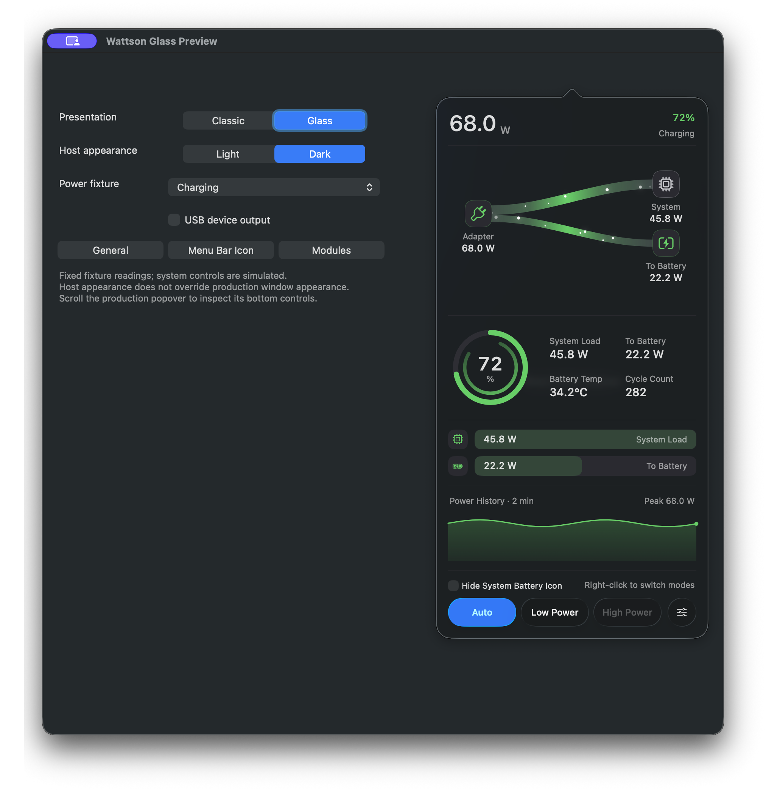
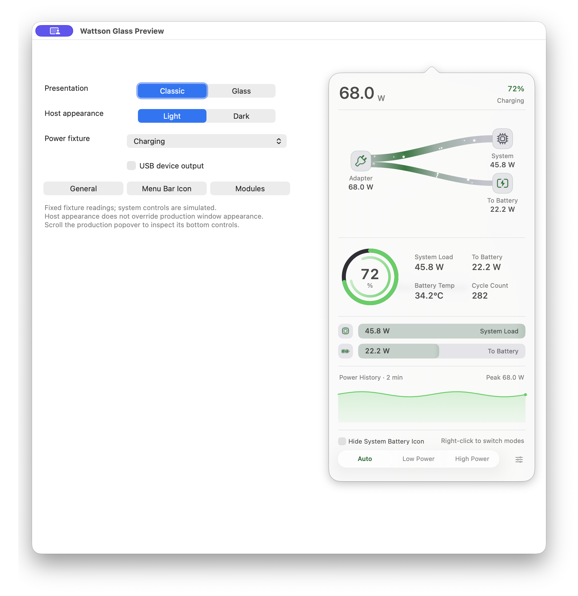
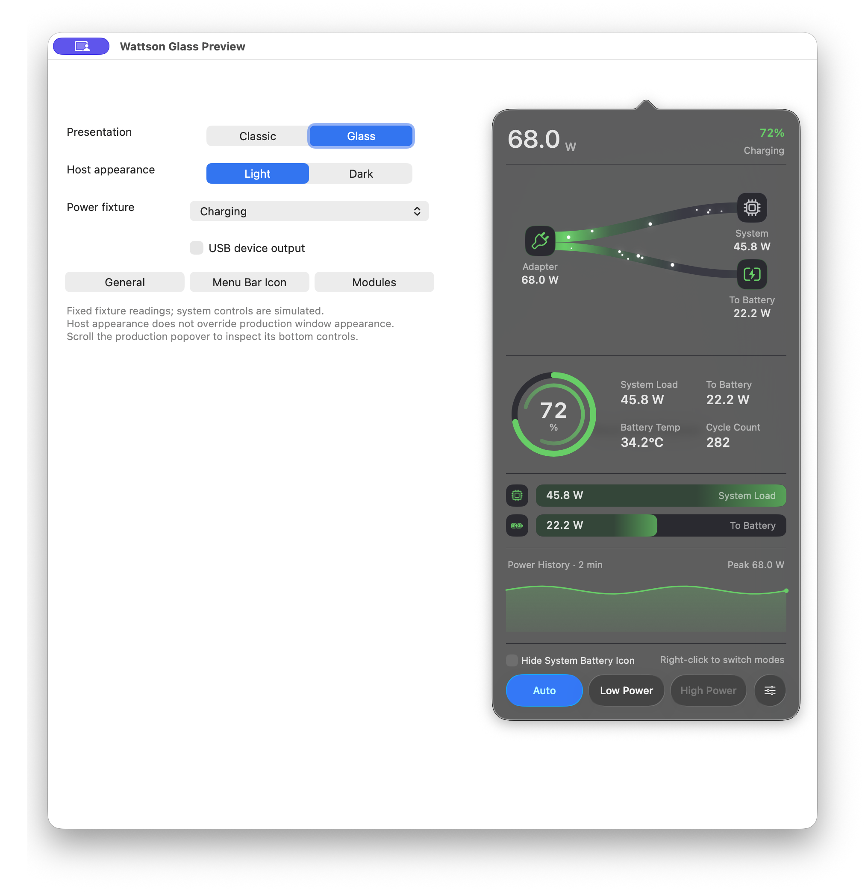
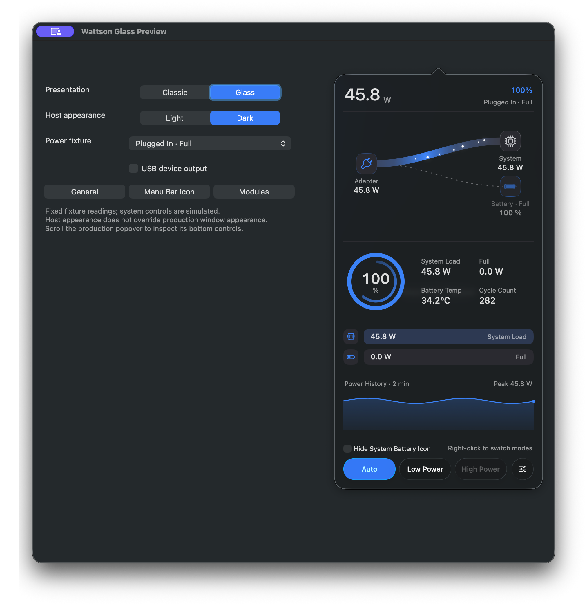
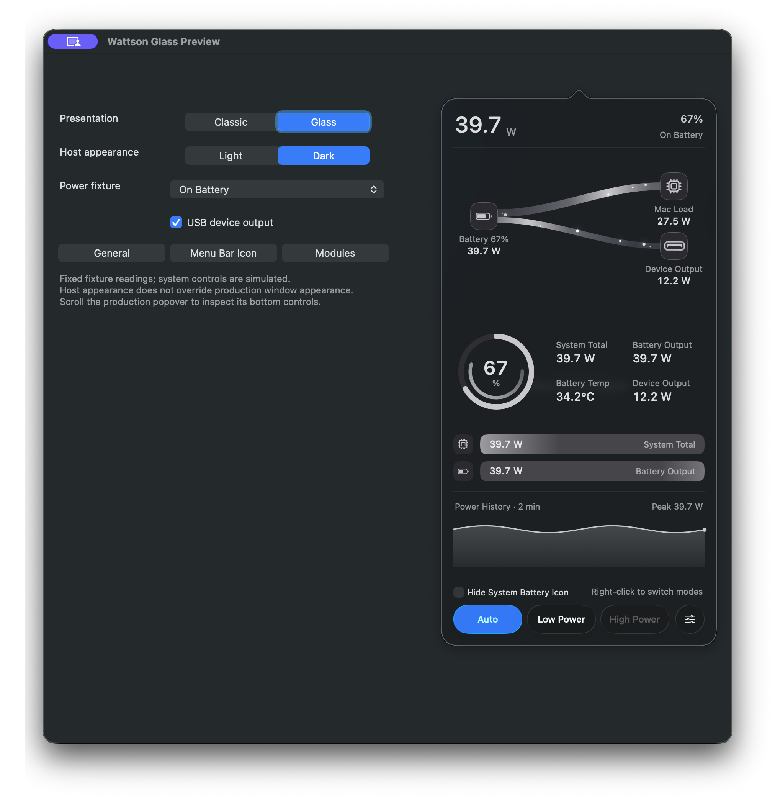
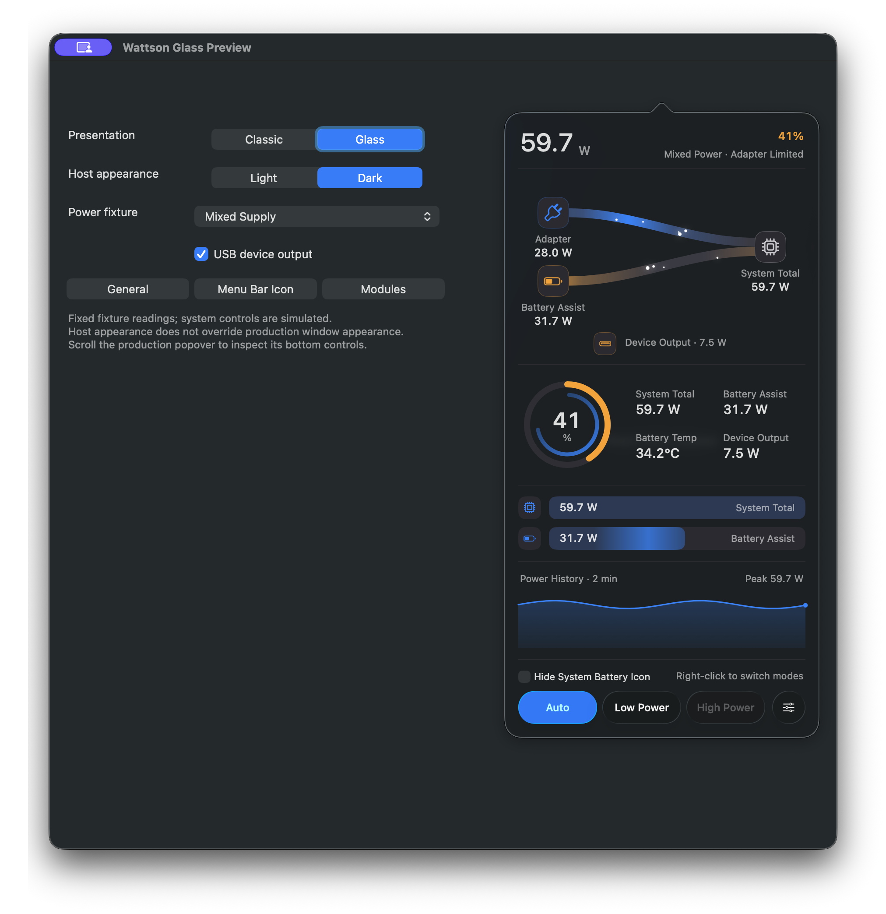
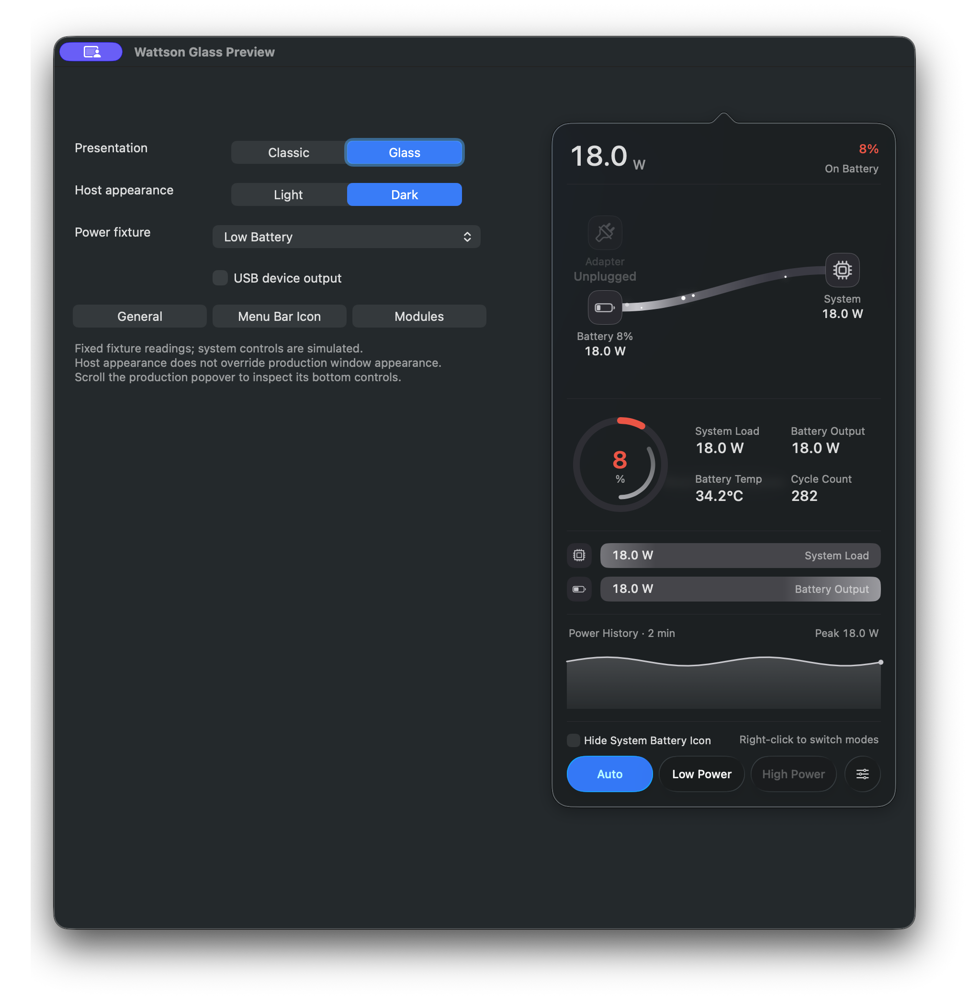
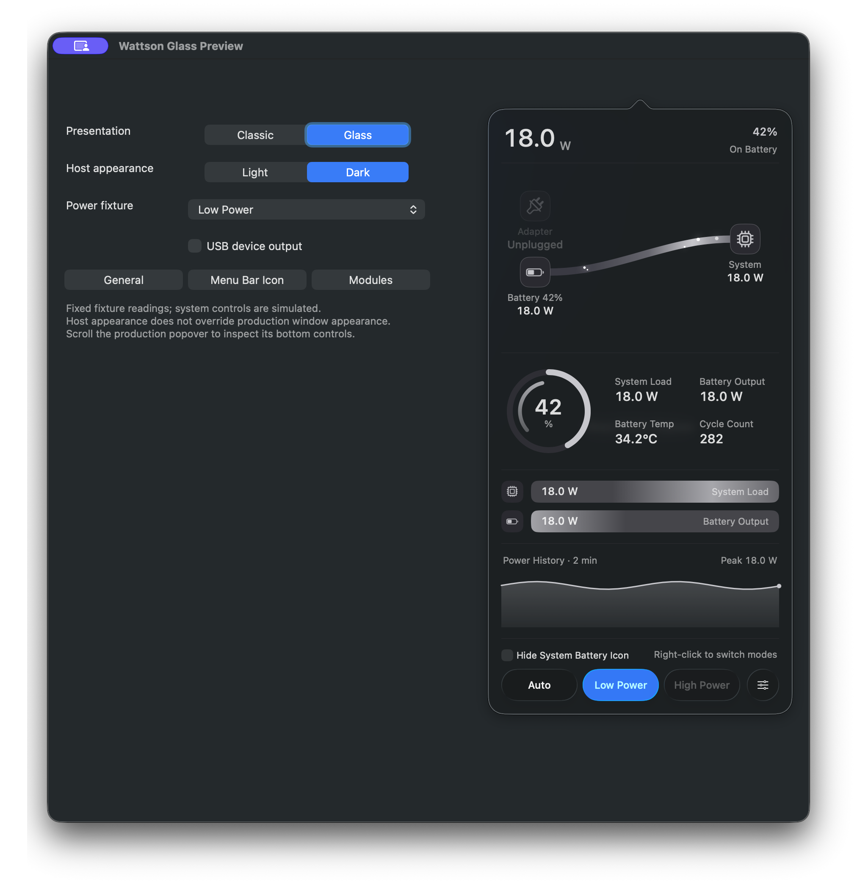

# Wattson 4.1.0 设计图库

这一版增加可选的 macOS 26 原生 Liquid Glass 外观，默认关闭；关闭后保留 Classic 外观。旧版 macOS 继续使用 Classic，不模拟新系统玻璃。

## 如何看这些截图

- 左侧是隔离的 fixture 调试台，用来选择固定电源状态；它不是 Wattson 的产品界面。右侧才是生产 AppKit 视图组成的主面板。
- 图片是实际合成窗口截图，无 AI 作图或界面重绘。固定读数仅用于展示状态与布局，不证明硬件测量精度、性能或能耗改善。
- Glass 主面板使用系统深色材料，观感会随底色、壁纸及系统外观变化；“浅色宿主”并不代表把 Glass 面板改成浅色。
- 本页是 **4.1.0 设计图库，不是发布状态证据**。截图不证明正式发布、签名、公证或安装验收已完成；发布信息请以对应 GitHub Release 和验证记录为准。

## 外观对照

### Glass · 深色环境 · 充电

黑色基调的系统材料，以及底部原生电源模式控件和菜单按钮。

### Classic · 浅色环境 · 充电

关闭可选 Glass 后的 Classic 主面板，保留原有控件与布局。

### Glass · 浅色宿主 · 充电

宿主切到浅色环境后，Glass 主面板仍使用系统深色材料；背景变化会影响玻璃的实际观感。

## 电源状态

以下均使用固定 fixture，便于比较同一界面在不同状态下的标签、颜色和功率关系。

### 已充满

满电状态下的主面板与状态提示。

### 电池供电 · 设备输出

展示电池供电并存在设备输出的场景；设备输出是系统负载的辅助拆分，不是额外叠加的一份总功耗。

### 混合供电 · 设备输出

展示适配器与电池共同供电时的功率关系及设备输出信息。

### 低电量

展示低电量状态的提示与语义颜色。

### 低电量模式

展示 Low Power 模式及当前电源模式选择；“低电量模式”与“电池电量低”是不同状态。

---

分享时请使用冻结版本标签对应的本页链接，使说明和截图始终指向同一版内容。
