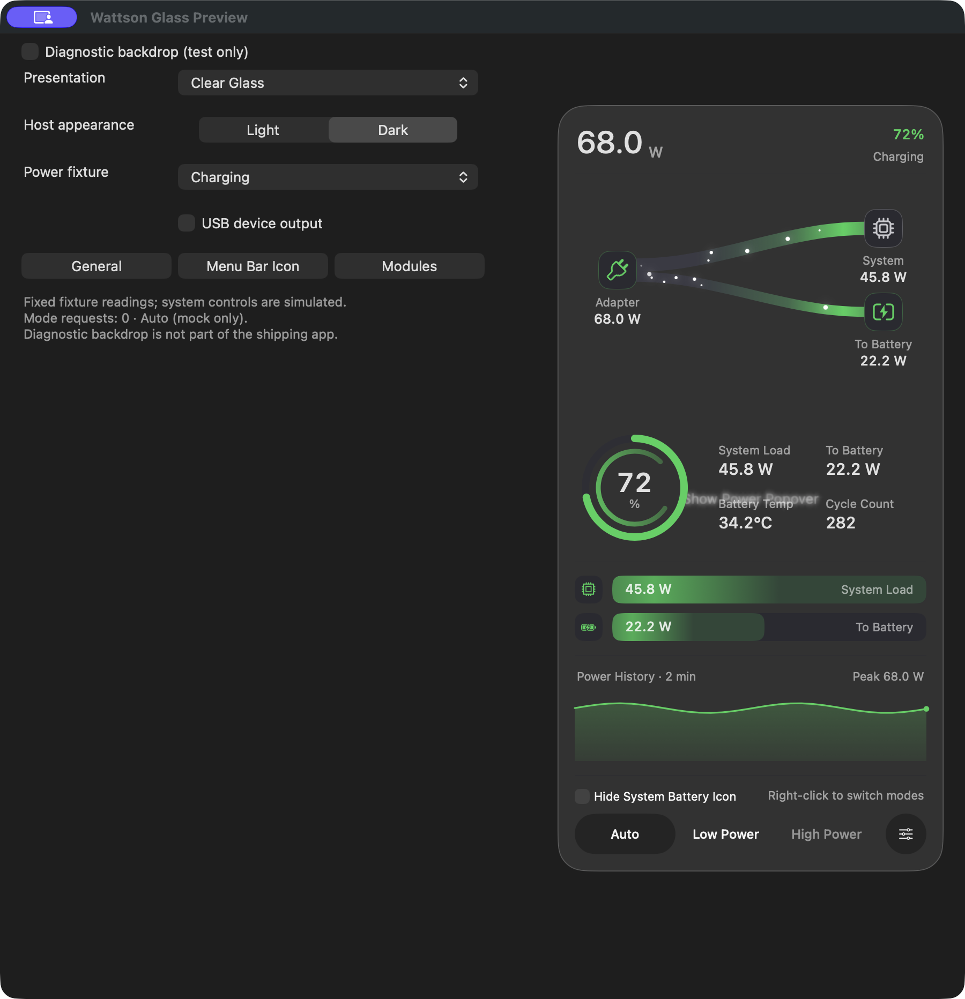
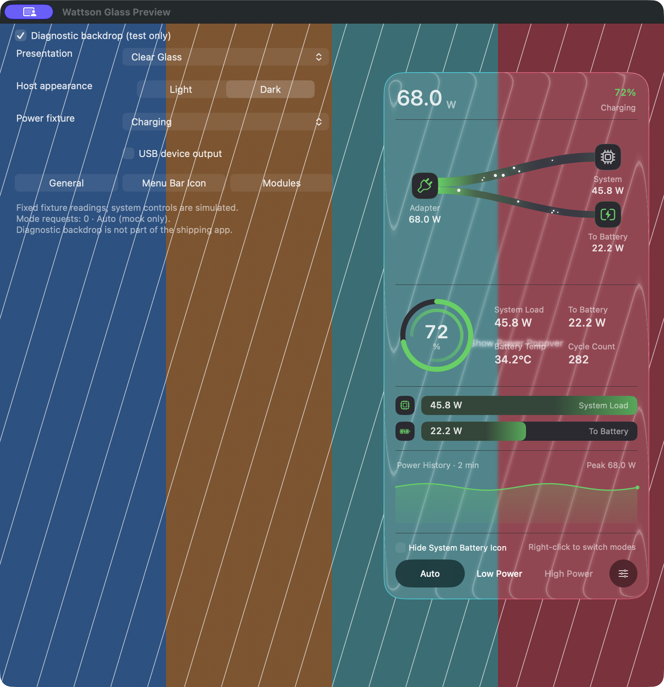
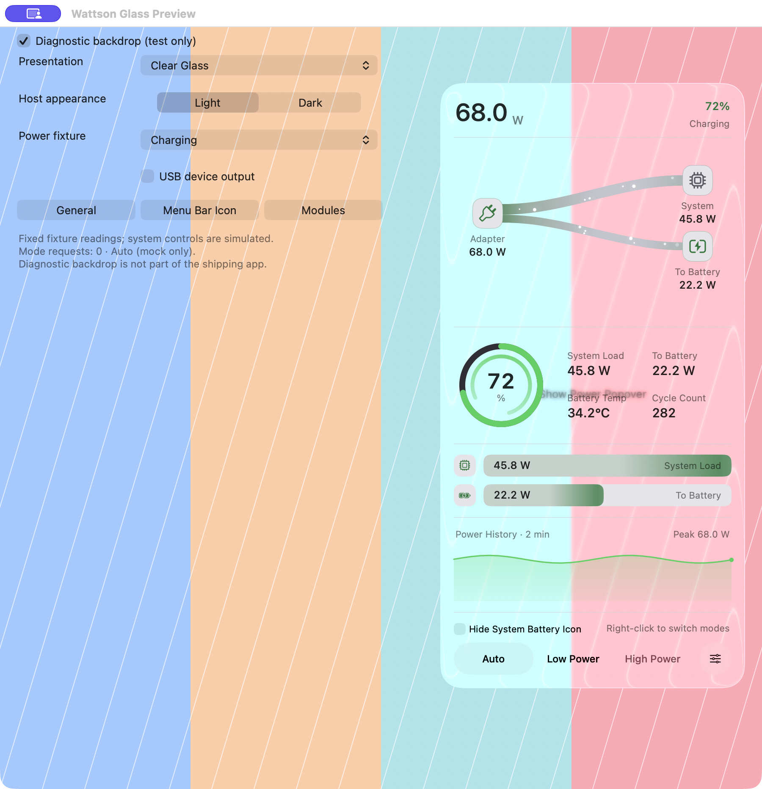
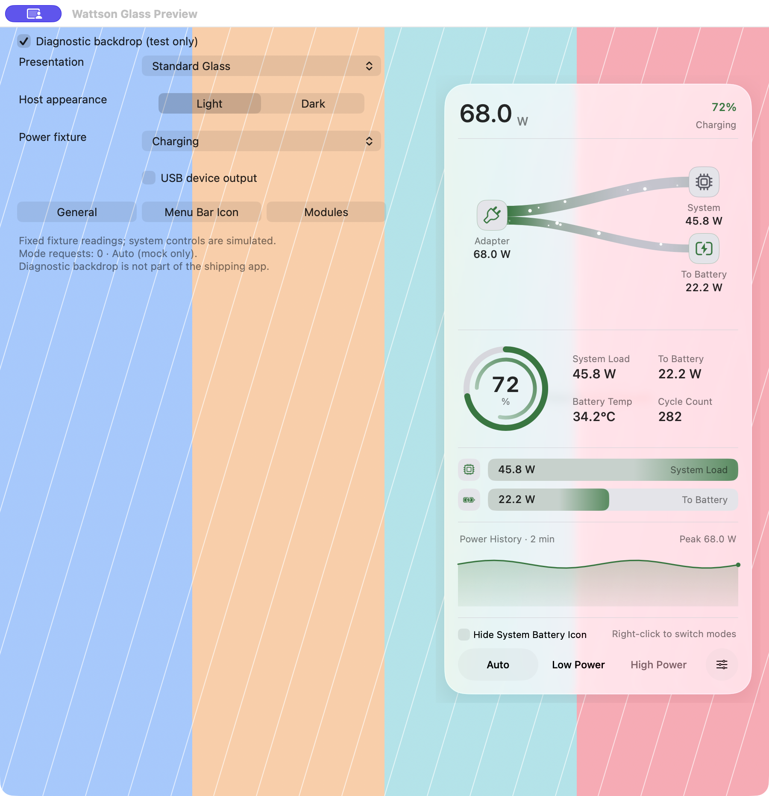
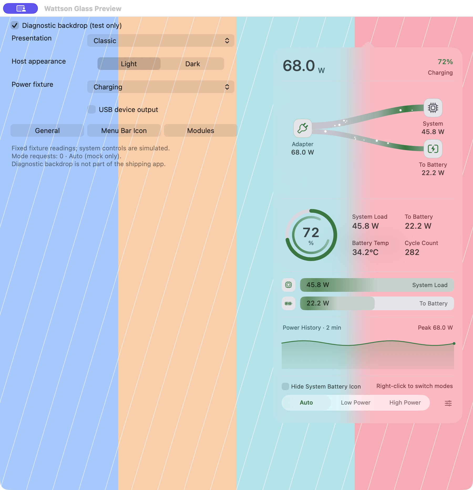

# Wattson 4.2.0 development preview

These are real macOS-composited captures of the isolated preview built from
4.2.0 development source on 13 September 2026. This is not a published release.
The canonical installed app remains 4.1.0.

The right-hand panel uses the production renderers with a fixed Charging
fixture (72%, 68.0 W adapter, 22.2 W battery input, 45.8 W system). Controls on
the left and the optional colored stripes belong to the test host. The blurred
“Show Power Popover” text visible through Clear Glass is the host's anchor
behind the panel. It is not an overlapping production label.

The preview offers **Classic**, **Standard Glass**, and **Clear Glass**.
Host Light/Dark and the diagnostic background are independent choices.

## Clear Glass

Dark host, plain background:

Dark and light hosts with the same optional striped background:

## Standard Glass and Classic

The same light host and fixture show the native Regular material, then the
Classic NSPopover after a live round trip. Both retain the content.

## Motion and verification

[Clear Glass motion sample](clear-glass-light-motion.mp4) is a 4.175-second
H.264 recording at 1800 × 1864, with no audio. Its two-second frame was
visually checked. This shows actual rendering, not an FPS or energy benchmark.
Window activation can affect the system's material and shadow treatment.

The images and recording use ScreenCaptureKit with a filter including only
the preview process and a crop to its host window. Existing host capture
permission was used; permission was not requested or changed. Each PNG was
inspected and copied unchanged into this directory. Checksums are in
[SHA256SUMS.txt](SHA256SUMS.txt).

Local verification on the matching production source:

- Swift: 350 tests pass with warnings treated as errors.
- Python: 494 tests, zero failures, four existing opt-in skips.
- Preview: 24 continuous presentation cycles, 120 checks, including all six
  power fixtures and delayed native close callbacks. Every check verifies the
  active content and the absence of orphaned visible glass panels.
- Disposable ARM GUI VM: 1,483 passing assertions across native, legacy,
  Reduce Motion, Reduce Transparency and Increase Contrast configurations.
  The Settings 500-cycle checks and 20,000 animation iterations also pass.
- Local universal PKG/DMG: signatures, resources, checksums and identical app
  contents pass. These local bytes are not the hosted release candidate.

The compiled-input manifest SHA-256 is
`0943e9050d5e323b5f3b412515d7b107cf93495116550cf98ba08b88fb5d0be3`.
The frozen source archive SHA-256 is
`7ffc3b782a983804c58fe8d2e5d93345c6294cdfd361e7fb0d568ff256a69137`.
Local logs are preserved under
`dist/release-4.2.0-20260913/continuation-20260913/`.

These five Charging screenshots are samples, not the full power-state ×
appearance visual cross-product, a hardware-accuracy measurement, or complete
manual VoiceOver acceptance. The automated six-state checks have a wider
scope than this gallery. Hosted release, public Homebrew/Pages, and canonical
installation gates are still pending.
