# Wattson 4.2.1

Choose **System**, **Light**, or **Dark** in General → Appearance. The sidebar now uses **General · Icon · Modules**.

### Settings

<table>
<tr><th>Light</th><th>Dark</th></tr>
<tr><td colspan="2"><strong>Theme and appearance</strong></td></tr>
<tr><td><a href="settings-glass-appearance-light.png">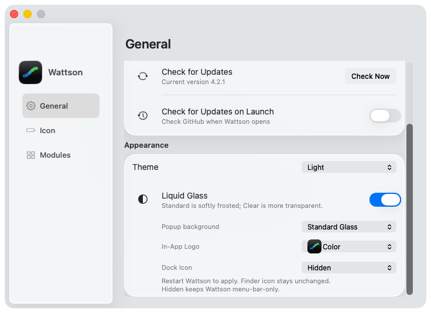</a></td><td><a href="settings-glass-appearance-dark.png">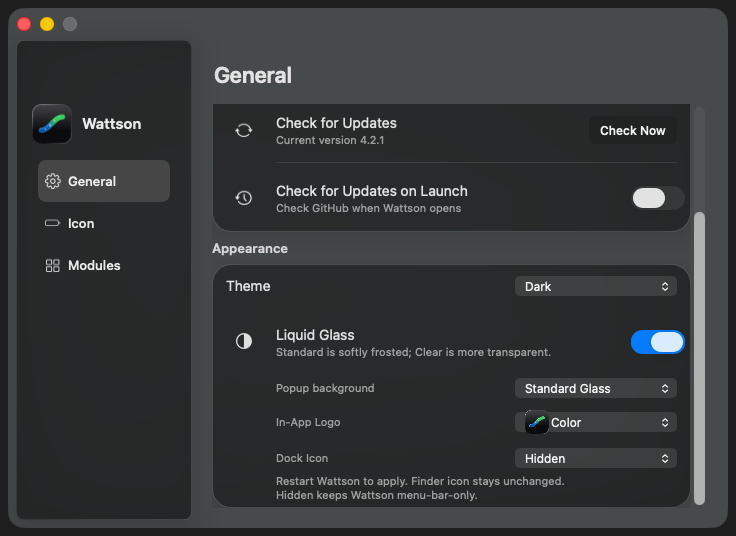</a></td></tr>
<tr><td colspan="2"><strong>General</strong></td></tr>
<tr><td><a href="settings-glass-general-light.png">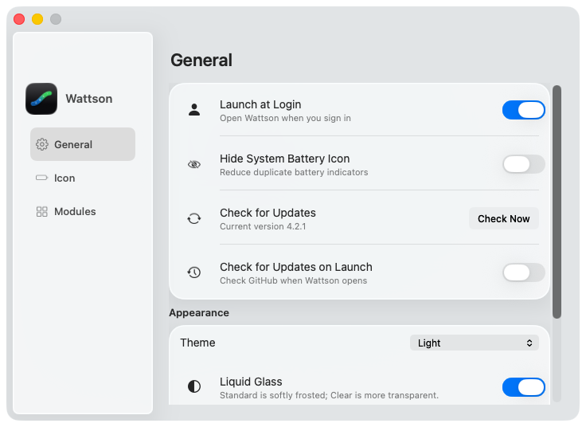</a></td><td><a href="settings-glass-general-dark.png">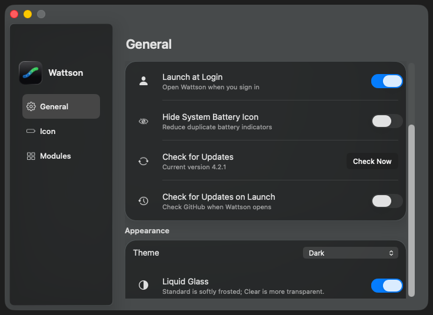</a></td></tr>
<tr><td colspan="2"><strong>Icon</strong></td></tr>
<tr><td><a href="settings-glass-menu-bar-icon-light.png">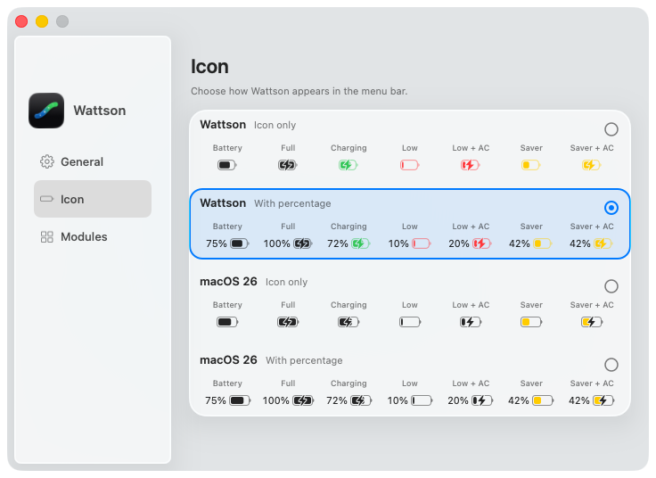</a></td><td><a href="settings-glass-menu-bar-icon-dark.png">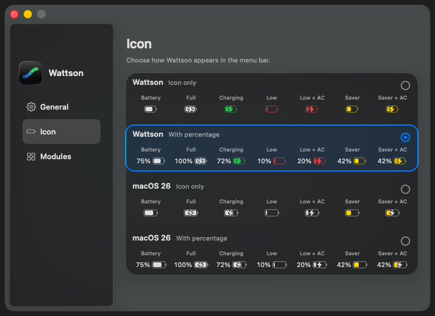</a></td></tr>
<tr><td colspan="2"><strong>Modules</strong></td></tr>
<tr><td><a href="settings-glass-modules-light.png">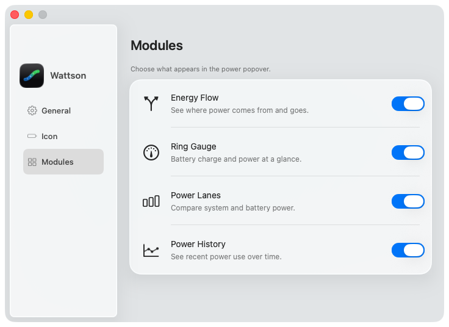</a></td><td><a href="settings-glass-modules-dark.png">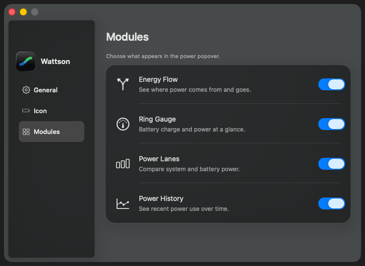</a></td></tr>
<tr><td colspan="2"><strong>Classic settings</strong></td></tr>
<tr><td><a href="settings-classic-appearance-light.png">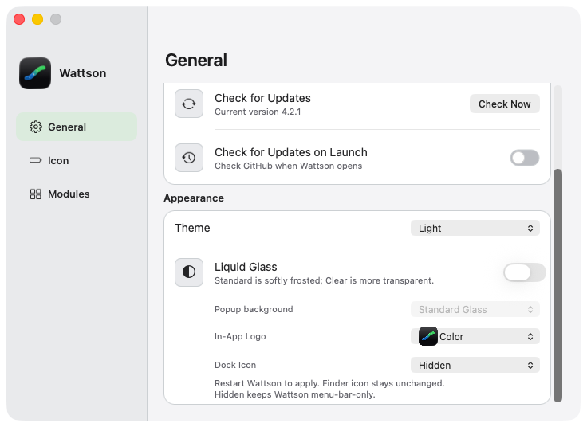</a></td><td><a href="settings-classic-appearance-dark.png">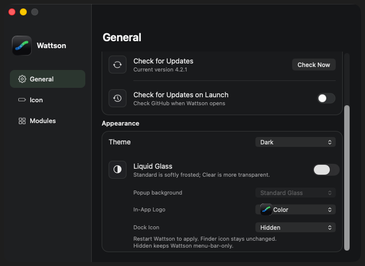</a></td></tr>
</table>

### Popup materials

<table>
<tr><th>Light</th><th>Dark</th></tr>
<tr><td colspan="2"><strong>Standard Glass</strong></td></tr>
<tr><td><a href="standard-charging-light.png">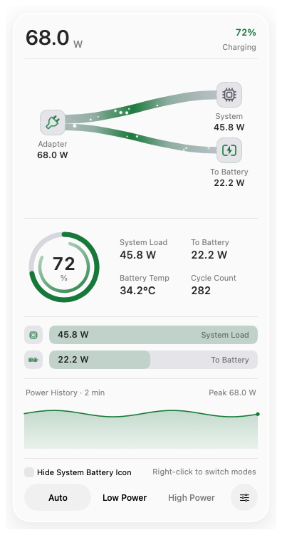</a></td><td><a href="standard-charging-dark.png">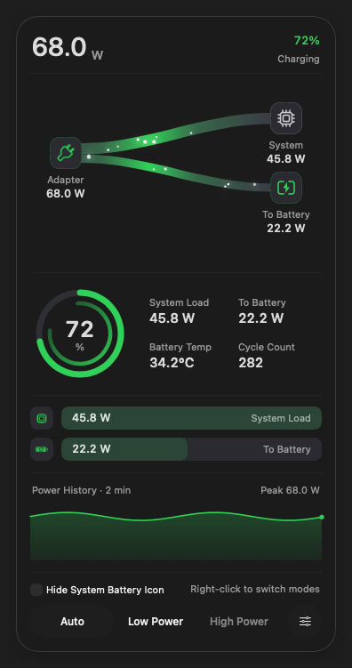</a></td></tr>
<tr><td colspan="2"><strong>Classic</strong></td></tr>
<tr><td><a href="classic-charging-light.png">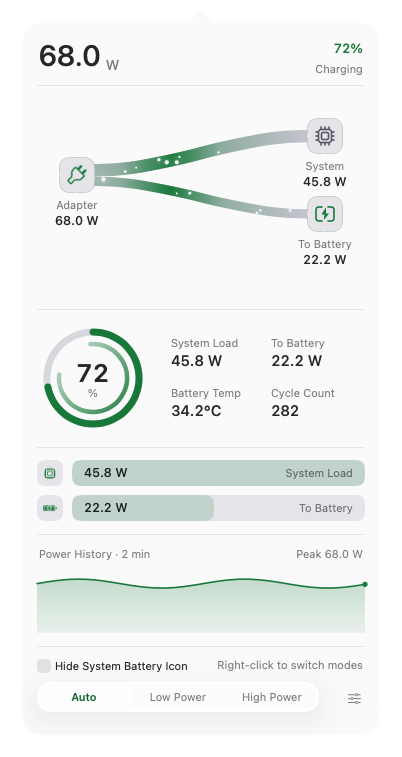</a></td><td><a href="classic-charging-dark.png">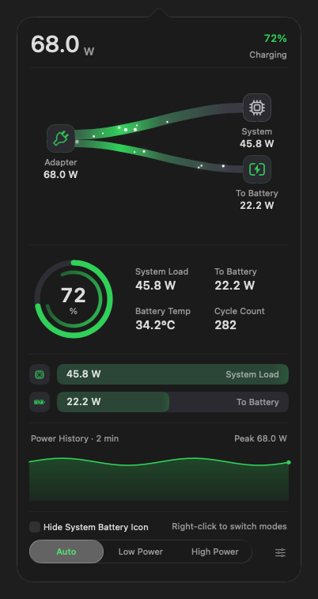</a></td></tr>
</table>

### Clear Glass · power states

<table>
<tr><th>Light</th><th>Dark</th></tr>
<tr><td colspan="2"><strong>Charging</strong></td></tr>
<tr><td><a href="clear-charging-light.png">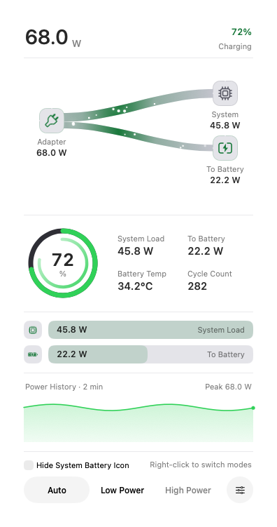</a></td><td><a href="clear-charging-dark.png">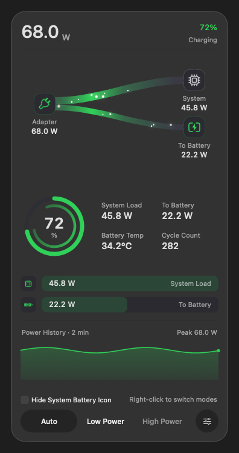</a></td></tr>
<tr><td colspan="2"><strong>Full</strong></td></tr>
<tr><td><a href="clear-full-light.png">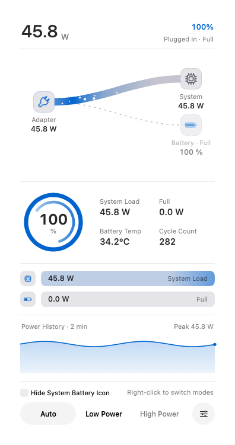</a></td><td><a href="clear-full-dark.png">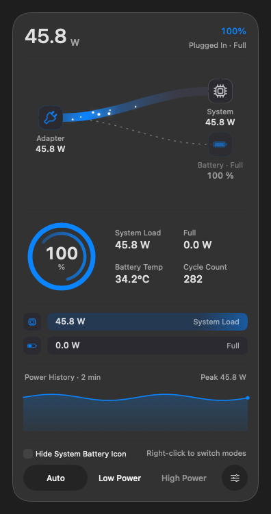</a></td></tr>
<tr><td colspan="2"><strong>On battery</strong></td></tr>
<tr><td><a href="clear-battery-light.png">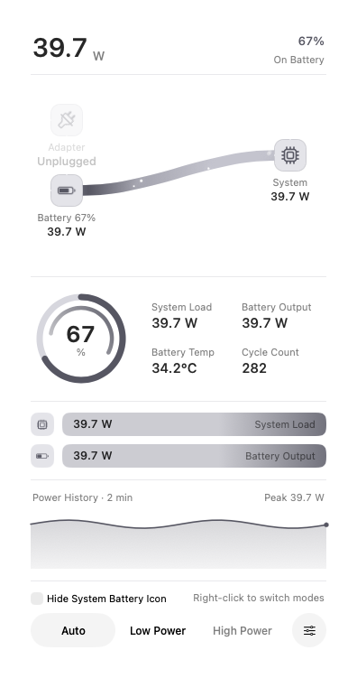</a></td><td><a href="clear-battery-dark.png">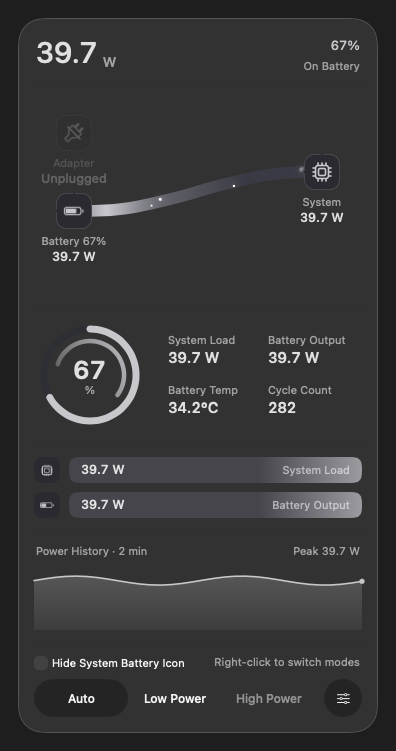</a></td></tr>
<tr><td colspan="2"><strong>Mixed supply</strong></td></tr>
<tr><td><a href="clear-mixed-light.png">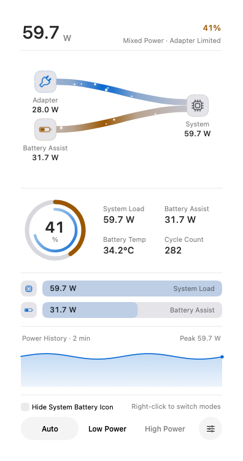</a></td><td><a href="clear-mixed-dark.png">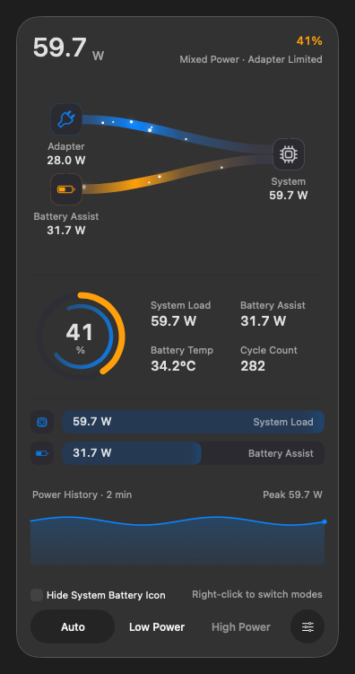</a></td></tr>
<tr><td colspan="2"><strong>Low battery</strong></td></tr>
<tr><td><a href="clear-low-battery-light.png">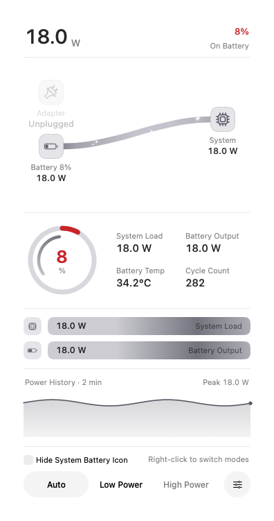</a></td><td><a href="clear-low-battery-dark.png">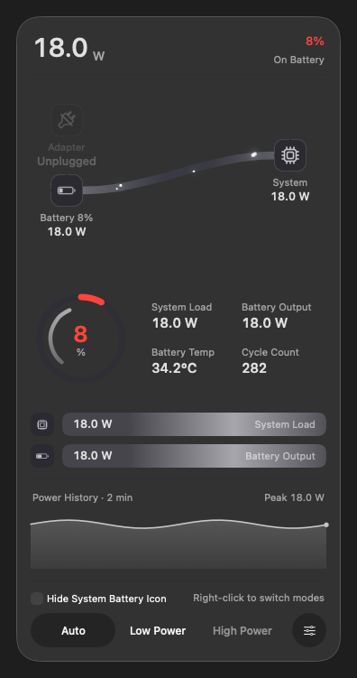</a></td></tr>
<tr><td colspan="2"><strong>Low Power</strong></td></tr>
<tr><td><a href="clear-low-power-light.png">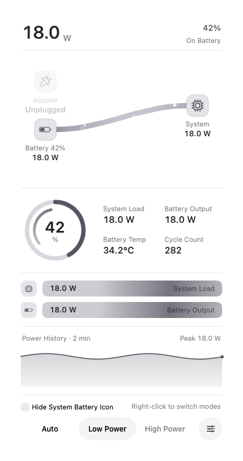</a></td><td><a href="clear-low-power-dark.png">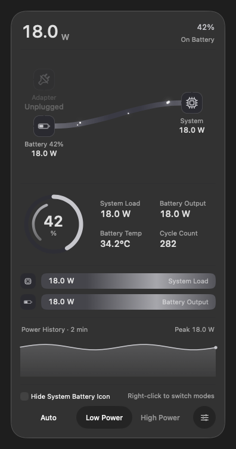</a></td></tr>
</table>

26 real WindowServer captures on macOS 26.6.1, using the production renderers and fixed power samples in an isolated preview. General is shown both at the top and scrolled to Appearance. Click an image for full resolution.

[Image checksums](SHA256SUMS.txt).
