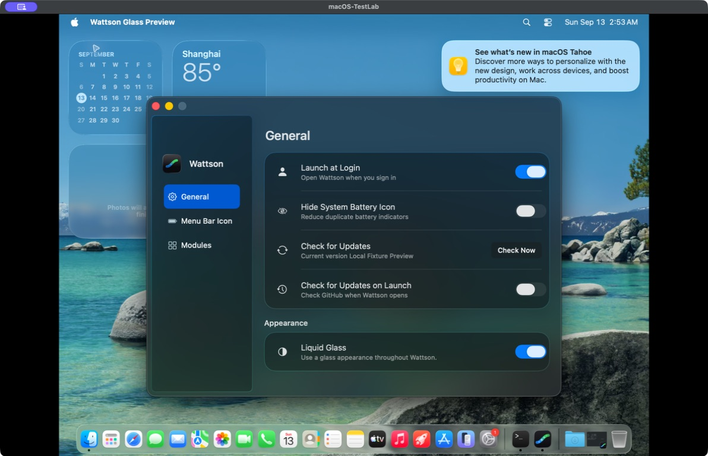

# Appearance preference hierarchy

Liquid Glass now belongs to General > Appearance. The sidebar contains identity
and navigation; it no longer mixes a global preference with page selection.
The appearance row shares the icon, label and switch alignment of other General
rows. It retains the existing app-wide preference and native NSSwitch action.

The custom NSGlassEffectContainerView is confined to the detail content. It no
longer encloses NSSplitViewController or its system-managed sidebar. General has
two functional glass groups; Menu Bar Icon and Modules retain one each.

General uses a top-aligned native scroll view. Its four operational rows and
appearance group fit without scrolling in the normal state; recovery help can
expand without hiding an unreachable appearance option. Only General includes
this switch in its Tab loop. The other pages return directly to navigation.
Appearance updates retain the same controls, focused view, settings and pending
helper/update operations.

## Actual windows

These are unedited compositor captures of the production Settings controller
inside the isolated preview app on macOS-TestLab 26.6.1. The preview uses
in-memory preferences and mock helper/update behavior; the desktop, widgets and
notification are VM context.

| Capture | State |
| --- | --- |
| [General, Glass](general-glass.jpg) | Liquid Glass in its Appearance group |
| [General, Classic](general-classic.jpg) | Same control switched off |
| [Modules, Glass](modules-glass.jpg) | Sidebar contains navigation only |

Source snapshots and logs are in `dist/settings-switch-hierarchy-20260913/`.
The preview's production source matches `source-final.tar.gz`; the final test
snapshot uses the Swift name `scrollToVisible(_:)` for the recovery reveal check.
Preview executable SHA-256:
`c893540908ec4e2e927e0b4bc61cb464483c57c9062e76657812c9175a3ed9c8`.

The final source passes 308 Swift tests with warnings treated as errors and
470 Python tests (466 passed, four existing GUI opt-in skips). The Settings
contract checks preference ownership, page-local keyboard loops, top alignment,
normal visibility, recovery scrolling, appearance changes and lifecycle.
The same six Settings tests pass with real GUI interaction enabled in the VM,
including keyboard navigation and 500-window lifecycle checks. The VM source
manifest verifies all 38 files with no mismatches.

This is a local source revision. It does not publish a release or replace
`/Applications/Wattson.app`.
