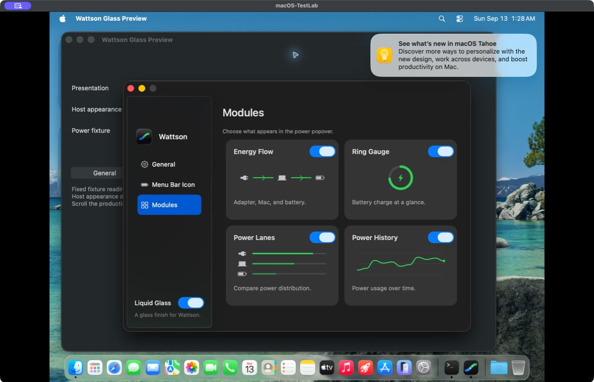

# Settings visual refinement

Historical review for commit `e2dc588`. The user rejected the Modules diagrams;
the current implementation is documented in the
[Modules list review](../modules-list/README.md). Screenshots and results below
describe the earlier revision.

The Settings window uses an AppKit `NSSplitViewController` sidebar on macOS 26
when Liquid Glass is enabled. AppKit supplies the floating navigation surface
and safe area. The content canvas is transparent beneath the native hierarchy;
content groups use a restrained semantic fill, without nested glass cards.
Classic mode retains its fixed dark layout and palette.

This revision's module illustrations occupied the width of each card. SF Symbols share a
consistent weight, energy diagrams keep a semantic green, and titles, switches
and descriptions align in three rows. Descriptions use 12-point wrapping text
with a bounded width. General settings use plain symbols and inset separators;
the icon chooser keeps its 28 production-rendered samples with fewer borders.

These images show the production Settings controller inside the isolated
Wattson Glass Preview app on the disposable ARM macOS-TestLab VM (macOS 26.6.1).
They are actual compositor screenshots, saved through the host's VM window.
The desktop, notification and preview controls behind Settings are test context.
They are not the installed product. The preview has in-memory preferences and
mock helper/update operations. No telemetry values represent hardware readings.

| Page | Actual window |
| --- | --- |
| Modules | [Glass](glass-modules.jpg) |
| General | [Glass](glass-general.jpg) |
| Menu Bar Icon | [Glass](glass-menu-bar-icon.jpg) |
| Classic round trip, same icon selection | [Classic](classic-menu-bar-icon.jpg) |

The source and verification logs are recorded in
`dist/settings-refinement-20260913/`. Preview binary SHA-256:
`c0308963469b0a99059bd3de31187db44880ed9f14c368869303713f06f1cf07`.

Headless validation: 308 Swift tests passed with warnings-as-errors; Python
ran 470 tests, 466 passed with four existing GUI opt-in skips. The settings
contract also verifies that native sidebar switching retains section instances,
authoritative settings, in-flight operations and keyboard focus, without new
helper requests. The canonical `/Applications/Wattson.app` has not been updated
by this source change.

Real AppKit interaction passed in five VM modes: native 168, legacy 166,
legacy with reduced effects 160, native with reduced transparency 167, and
native with increased contrast 168 assertions (829 total, zero failures).
The existing non-applicable synchronous-close skip remains.

Six fresh production popover renders cover charging, full, on-battery, mixed
supply, low battery and Low Power. These are view-cache layout checks, not
compositor or motion evidence. The initial capture harness incorrectly expected
a 360-point document even with a legacy scroller; the corrected check compares
the document with the actual viewport and passes all six. Production code was
unchanged. The six original images were exported and visually reviewed, and
both check logs are preserved locally. The second archive transfer was
interrupted when the VM stopped; that incomplete file is explicitly marked.
The test VM is stopped; the base VM and canonical installation were untouched.
