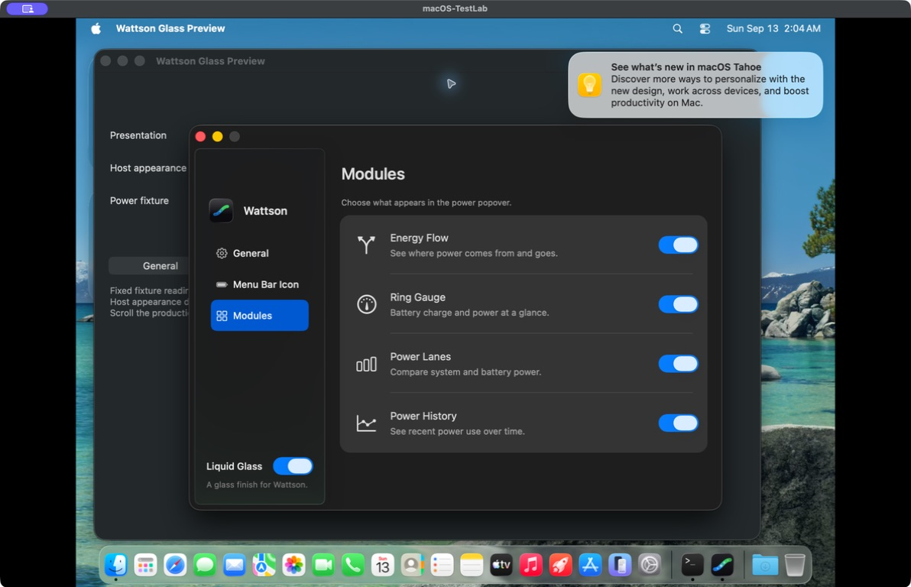

# Modules settings revision

Intermediate review before the user's whole-window material feedback. The
current surface treatment is in the [native glass review](../native-glass/README.md).
The module list, text and symbols below are retained in that revision.

The user rejected the small plug, laptop and battery diagram with bright green
arrows. The four decorative cards have been replaced by one grouped settings
list. Each 80-point row has a monochrome SF Symbol, a name, a 12-point
description and a switch aligned on the right. Inset separators start at the
text column. The existing native sidebar and appearance behavior are retained.

The symbols are `arrow.triangle.branch`, `gauge`, `chart.bar` and
`chart.xyaxis.line`. Apple's local CoreGlyphs availability data places all four
at macOS 12 or earlier. The Settings page does not sample telemetry or draw
miniature power diagrams. Changes are in `MenuBar/SettingsWindowController.swift`.

These are unedited compositor screenshots of the production Settings controller
inside the isolated Wattson Glass Preview app on macOS-TestLab (macOS 26.6.1).
Preferences are in memory, helper and update operations are mocked, and the
surrounding desktop, notification and preview controls are test context.

| Capture | State |
| --- | --- |
| [Glass](glass.jpg) | All four modules enabled |
| [Classic](classic.jpg) | Energy Flow disabled by clicking its switch |
| [Glass after switching back](glass-state-retained.jpg) | Energy Flow remains disabled |

The preview was built with warnings treated as errors from the current source
snapshot at `dist/settings-modules-list-20260913/source-v2.tar.gz`. Preview
executable SHA-256:
`6dd95d1d0eb921557e198e90a9ed03632b6fc30949ce61b63b94eeecf875b38f`.
Its isolated-defaults self-test passed.

The final source passes 308 Swift tests and 470 Python tests (466 passed,
four existing GUI opt-in skips). The updated Settings contract checks symbol
resolution, alignment rectangles, complete label widths, module actions and
accessibility contrast, while preserving the existing focus and lifecycle
checks. The initial icon-size assertion used view frames; it was corrected to
use AppKit alignment rectangles because SF Symbols have optical alignment
insets. Both logs are preserved in `dist/settings-modules-list-20260913/`.

This is a source revision with test-VM preview evidence. It does not install or
publish a release; the canonical `/Applications/Wattson.app` is unchanged.
