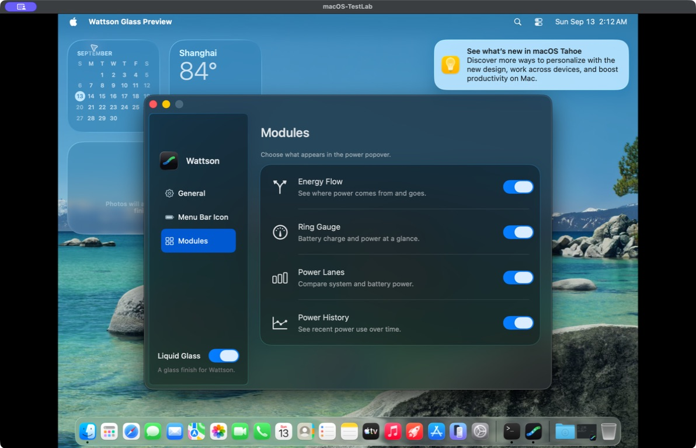

# Native glass Settings

The user's Control Center reference called for material across the Settings
window, including the backdrop, navigation and functional control groups.
The previous version had a native sidebar over an opaque window background
and ordinary translucent group fills, which obscured the overall effect.

The current AppKit implementation follows these public Apple APIs:

- [Adopting Liquid Glass](https://developer.apple.com/documentation/technologyoverviews/adopting-liquid-glass): remove custom backgrounds that obscure system materials, preserve native controls, and avoid stacking glass on every content element.
- [Under-window material](https://developer.apple.com/documentation/appkit/nsvisualeffectview/material-swift.enum/underwindowbackground): use `.underWindowBackground` with `.behindWindow` blending for the utility window backdrop. The glass window is nonopaque with a clear background; AppKit owns its blur and active-state response.
- [NSGlassEffectView](https://developer.apple.com/documentation/appkit/nsglasseffectview): place each page's functional controls inside the actual `contentView` of one regular, untinted glass surface. Inner group fills are transparent. AppKit produces the glass edge and material; there are no custom highlight gradients or blur filters.
- [NSGlassEffectContainerView](https://developer.apple.com/documentation/appkit/nsglasseffectcontainerview): batch related descendant effects with spacing zero, without merging distinct surfaces. The existing NSSplitViewController still owns the sidebar.

Classic mode restores its opaque window and original palette. Appearance
changes retain the same section controllers and controls, including their
settings, keyboard focus and pending helper/update operations. Module diagrams
have been replaced by aligned monochrome symbols and descriptive text.

## Actual windows

These are unedited host captures of the disposable macOS-TestLab VM on macOS
26.6.1. The preview app uses the production Settings controller with in-memory
preferences and mocked helper/update operations. The desktop and its widgets
and notification are VM context. The system material samples the real backdrop,
so color and contrast vary with window placement and activation.

| Page | Desktop backdrop |
| --- | --- |
| Modules | [Actual window](modules-desktop.jpg) |
| General | [Actual window](general-desktop.jpg) |
| Menu Bar Icon | [Actual window](menu-bar-icon-desktop.jpg) |
| System Reduce Transparency enabled | [Opaque, readable fallback](modules-reduced-transparency.jpg) |
| Classic, Energy Flow switched off | [Actual window](modules-classic.jpg) |
| Glass restored, Energy Flow still off | [Actual window](modules-glass-restored.jpg) |

System Reduce Transparency was enabled through the VM's System Settings UI;
the native backdrop and group glass automatically became opaque while labels
and switches stayed readable. The option was then restored to its original off
state, and the material returned without restarting the preview.

The final production source passes 308 Swift tests with warnings treated as
errors, plus 470 Python tests (466 passed and four existing GUI opt-in skips).
The Settings contract now verifies that the transparent window does not paint
over its system backdrop, each page has one untinted native control-group
surface, and related effects share the container. It also retains keyboard
focus, settings state, helper/update request counts and lifecycle checks.
The same Settings suite also passed all six tests with real AppKit interaction
enabled in the test VM, including keyboard operation and the 500-window
lifecycle check. All 38 files in the VM source manifest match the final snapshot.
Fresh production popover renders cover charging, full, battery, mixed supply,
low battery and Low Power; all six document-width checks passed. Their original
PNGs were exported and inspected. These view-cache captures check layout only
and do not reproduce the native compositor's glass or controls; the Settings
screenshots above are the material evidence.

Preview executable SHA-256:
`f57206f0a16cb950c95afd440db527be46b906f8623ba7264c2de977e5be15cd`.
The preview's compiled production sources match `source-v2.tar.gz` and
`source-manifest.json`; the second snapshot adds the final test changes.

Source snapshots, Apple documentation, manifests and verification logs are in
`dist/settings-glass-material-20260913/`. This source revision does not publish
or install a release; `/Applications/Wattson.app` is unchanged.
